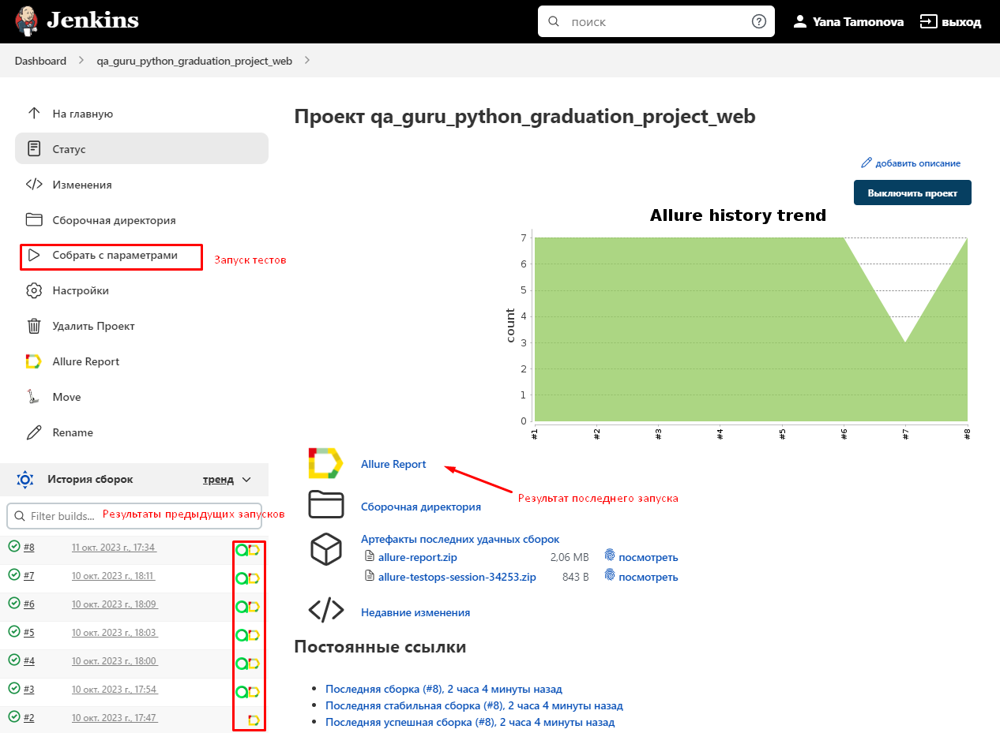

## Пример проекта UI автотестов на демо-сайте [Swag Labs](https://www.saucedemo.com)
<p align="center">
    &nbsp;
</p>

## Используемые технологии
<p>
<a href="https://www.python.org/"></a>
<a href="https://docs.pytest.org/en/"></a>
<a href="https://www.jetbrains.com/pycharm/"></a>
<a href="https://www.selenium.dev/"></a>
<a href="https://github.com/yashaka/selene/"></a>
<a href="https://github.com/"></a>
<a href="https://www.jenkins.io/"></a>
<a href="https://allurereport.org/"></a>
<a href="https://qameta.io/"></a>
<a href="https://aerokube.com/selenoid/"></a>
<a href="https://telegram.org/"></a>
</p>

## UI тесты:
* Авторизация пользователей
* Товары: открытие карточки товара, успешный заказ, заполнение обязательных полей, удаление товара из корзины

Пример запущенного теста (Успешный заказ):
<p align="center">
    &nbsp;
</p>

## Запуск тестов
#### По умолчанию все тесты запускаются удалённо на Selenoid

### Для локального запуска
1. Склонируйте репозиторий
2. Откройте проект в PyCharm
3. Введите в терминале команду
``` 
python -m venv .venv
source .venv/bin/activate
pip install -r requirements.txt
pytest .
```
### Для запуска тестов из [Jenkins](https://jenkins.autotests.cloud/job/qa_guru_python_graduation_project_web/):
Для запуска тестов из **Jenkins** нажмите «Собрать с параметрами», выберите браузер и версию (для Firefox 97.0/98.0, для Windows 99.0/100.0), нажмите «Собрать»

&nbsp;
&nbsp;

### Для запуска тестов из [Allure Test Ops](https://allure.autotests.cloud/project/3714):
Реализована интеграция с **Allure Test Ops**, откуда напрямую можно запускать тесты. В **Allure Test Ops** также есть возможность настраивать параметры запуска, выбирая конкретные тестовые случаи.

&nbsp;
&nbsp;

## Отчет о пройденных тестах в [Allure Report](https://jenkins.autotests.cloud/job/qa_guru_python_graduation_project_web/allure/) и тестовая документация:

### Локальный запуск тестов

Для MacOS введите в терминале команду 
```
allure serve allure-results
``` 
Для Windows введите в терминале команду 
```
allure.bat serve allure-results
``` 

### Запуск тестов из Jenkins или Allure Test Ops

**Allure Report** можно открыть на странице Jenkins (см. скриншот Jenkins в разделе выше) и содержит графику, детализацию выполнения тестов, различные виды вложений (скриншоты, логи, видео, html-код).
&nbsp;
&nbsp;

**Allure Test Ops** также содержит информацию о прохождении и создает тестовую документацию.
&nbsp;
&nbsp;

## Нотификация о прохождении тестов

После выполнения тестового запуска будет отправлено телеграмм-сообщение со следующей информацией:
* общее количество тестов и продолжительность выполнения
* процент пройденных/неудачных/пропущенных/и т.д. тестов
* ссылка на allure отчет

<p align="center">
&nbsp;
</p>

Для отправки сообщений в телеграм была использована [notifications library](https://github.com/qa-guru/allure-notifications), создан и добавлен в чат телеграм бот.